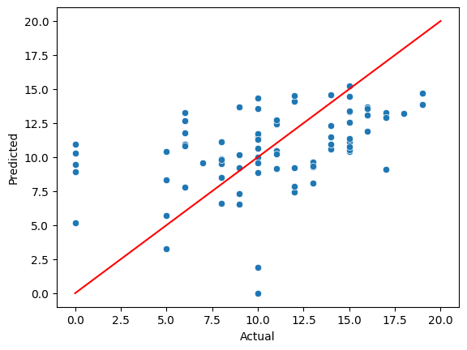

# 🎓 Student Performance Predictor

📊 Predicting student performance with MAE ~3.39 using regression models

## 📌 Overview
This project predicts a student's final grade (G3) using machine learning based on factors like study time, family background, and lifestyle habits.

---

## 🎯 Objective
To build a regression model that can estimate student performance and understand which factors influence academic success.

---

## 📂 Dataset
- Source: UCI Student Performance Dataset
- Features include:
  - Demographics (age, gender)
  - Academic behavior (study time, failures)
  - Lifestyle (internet, activities, etc.)

---

## ⚙️ Tech Stack
- Python
- Pandas, NumPy
- Seaborn, Matplotlib
- Scikit-learn

---

## 🔍 Workflow

1. Data Loading & Understanding  
2. Data Preprocessing  
   - No missing values  
   - Categorical encoding using one-hot encoding  
3. Exploratory Data Analysis (EDA)  
4. Model Building (Linear Regression)  
5. Model Evaluation  

---

## 📊 Results

- **Mean Absolute Error (MAE): ~3.39**
- The model predictions closely follow actual values with some deviations.

---

## 📈 Visualizations

### 🔹 Actual vs Predicted Scores



## 🧠 Key Insights

- Study time and past performance influence final grades  
- Model shows a clear positive correlation between predicted and actual values  
- Some outliers indicate room for improvement  

---

## 🚀 Future Improvements

- Use advanced models (Random Forest, XGBoost)
- Feature engineering for better accuracy
- Deploy as a web app using Streamlit

---

## 📎 How to Run

```bash
pip install -r requirements.txt
